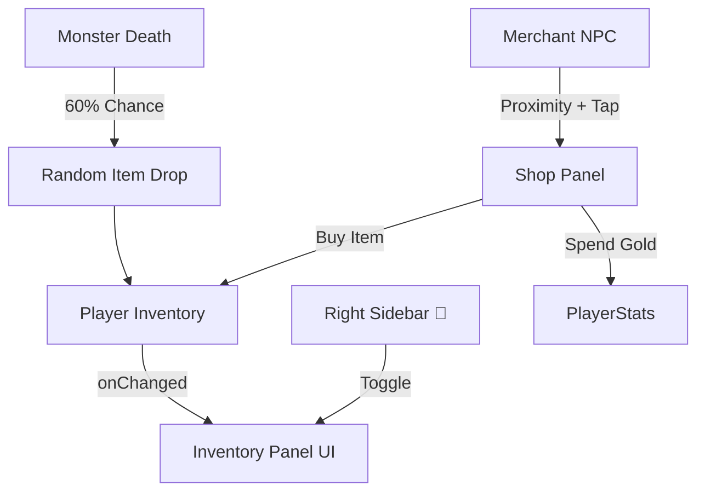

# Phase 8 Walkthrough — Complete Vertical HUD & UI Polish (80-85%)

## New Systems Created

| Component | Path | Purpose |
|-----------|------|---------|
| AssetManager | `src/core/AssetManager.ts` | Added `getUITextureUrl` generator for dynamic base64 placeholder UI textures when files are missing. |
| HUD | `src/ui/HUD.ts` | Converted all TextBlock emojis (Avatar, ATK, Skills, Sidebar) into Image controls loaded via AssetManager. Improved thumb-friendly zones. |
| ItemDatabase | `src/systems/ItemDatabase.ts` | Source of truth for 20+ items across 4 rarity tiers. Defines prices, stats, and loot drops. |
| Inventory | `src/systems/Inventory.ts` | Data layer for player's 30-slot bag with item stacking constraint (`maxStack`). |
| InventoryPanel | `src/ui/InventoryPanel.ts` | 5×6 glassmorphic grid UI with rarity-colored borders. Shows item details, "Use", and "Sell" buttons. |
| Merchant NPC | `src/entities/Merchant.ts` | Procedural robed NPC with staff and "🛒 SHOP" label. Shows a proximity interact prompt. |
| ShopPanel | `src/ui/ShopPanel.ts` | Scrollable merchant shop overlay allowing purchases with Gold, animated visual feedback for insufficient funds/successful buys. |

## Modifed Systems

| Component | Changes |
|-----------|---------|
| Player | Added `inventory` property initialized with 30 slots and starting potions/materials. |
| CombatSystem | Connected `ItemDatabase.getRandomDrop()` to `monsterManager.onMonsterDeath`. 60% chance to drop a random rarity item directly to the player's bag. |
| HUD | Wired the right sidebar **Backpack** (🎒) button to toggle the `InventoryPanel`. |
| MainScene | Created the `Merchant` NPC at `(8, 0, 8)` and connected its `onInteract` event to toggle the `ShopPanel`. |

## Architecture



## Screenshots

````carousel

<!-- slide -->

````

## Video


## 🎮 F5 → 操作步驟
1. `npm run dev` → 打開瀏覽器 (確保跑在 `localhost:3000` 直式模式，或用 F12 手機模擬器)。
2. 查看左上角的角色頭貼框、右側面的各項選單圖示、以及右下角的環形技能按鈕群。
   - 所有元素都不再是單純文字 Emoji，而是帶底色、邊框與圓角的圖片材質 (`GUI Image`)。
   - 如果 `assets/ui/` 底下沒有該 PNG 圖片，`AssetManager` 會即時生成高品質的 Placeholder 材質！
3. 點擊測試右側邊欄 🎒 背包圖示與 🌟 商店圖示功能是否平滑彈出。
4. 體驗大拇指點擊右下角攻擊與技能的觸感！
