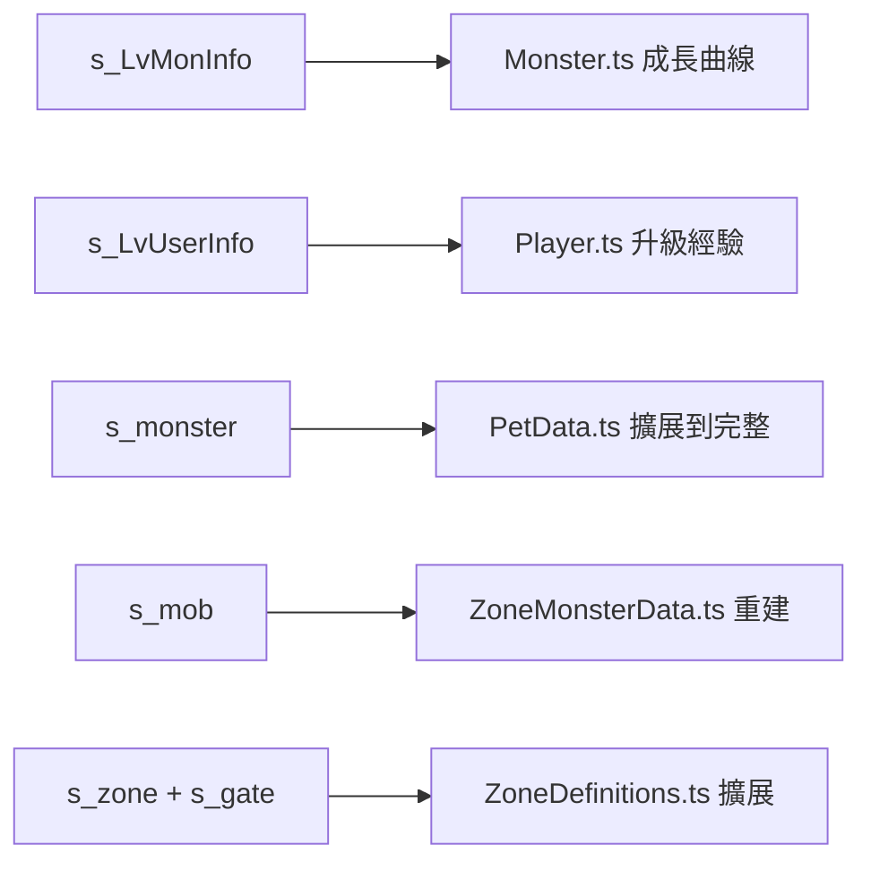

# 🗄️ GameDB 數據分析報告

## 總覽

`scripts/gamedb/` 包含從 MySQL 匯出的 **38 張表 / 20,513 行**數據。以下分析每張表的價值、與現有代碼的對比、以及推薦整合方案。

---

## 一、數據分級評估

### 🟢 A 級：核心數據（應直接替換現有 hardcode）

| 表名 | 行數 | 大小 | 現有對應 | 分析 |
|------|------|------|---------|------|
| `s_monster` | 1,418 | 1MB | [PetData.ts](file:///D:/AI-RPGGAME/src/pets/PetData.ts) (40 pets) | **現有只有 40 個 pet，DB 有 1,418 個！** 包含 `race`、`stat_rate`、`hp_rate`、`attack_range`、`core_rate`(蛋掉率)、`speed_attack/move` 等完整數值。可擴展 PET_DEFS 到完整規模 |
| `s_mix` | 720 | 90KB | [PetFusion.ts](file:///D:/AI-RPGGAME/src/pets/PetFusion.ts) | **720 條融合公式**（mainnum + subnum → result），比現有手寫 fusionRecipes 完整 35 倍 |
| `s_mob` | 889 | 1.4MB | [ZoneMonsterData.ts](file:///D:/AI-RPGGAME/src/world/ZoneMonsterData.ts) | **889 條怪物刷新配置**：zone_idx、aggressive、appear_rate、interval_time、monster_type、sight_range。現有只有 ~25 個 MapMon 區域 |
| `s_LvMonInfo` | 210 | 53KB | 無 ❌ | **怪物 Lv1-210 成長曲線**：HP/MP/STR/DEX/AIM/Luck/ATT/AP/DP/GiveExp/MixRate。**完全缺失！** |
| `s_LvUserInfo` | 200 | 10KB | 無 ❌ | **玩家 Lv1-200 升級經驗表**。**完全缺失！** 目前遊戲沒有正式升級曲線 |
| `s_SkillProperty` | 31 | 11KB | [SkillTree.ts](file:///D:/AI-RPGGAME/src/systems/SkillTree.ts) | **31 種技能定義**：中文名、targetClass、effectIndex、maxLevel、learningGold。現有 SkillTree 是框架性代碼 |
| `s_SkillData` | 140 | 28KB | 無 ❌ | **技能等級數據**：每個技能 5-7 級的 consumedMp、coolTime、requireSP、continuityTime。**完全缺失！** |
| `s_gate` | 140 | 17KB | [ZoneDefinitions.ts](file:///D:/AI-RPGGAME/src/world/ZoneDefinitions.ts) | **140 條傳送門連接**：from_zone → dest_zone。現有只有手寫 17 對 |
| `s_zone` | 201 | 98KB | [ZoneDefinitions.ts](file:///D:/AI-RPGGAME/src/world/ZoneDefinitions.ts) (17 zones) | **201 個區域定義**：等級範圍、怪物密度、PK flag。現有只有 17 個。⚠️ 部分名稱有亂碼 |
| `s_hero` | 4 | 3KB | [Player.ts](file:///D:/AI-RPGGAME/src/entities/Player.ts) | 迪特/简/芬利/波伊 四職業基礎屬性。✅ 數據品質佳，已部分使用 |

---

### 🟡 B 級：重要輔助數據（P3-P5 階段整合）

| 表名 | 行數 | 大小 | 用途 | 分析 |
|------|------|------|------|------|
| `s_item` | 4,608 | 5.1MB | 完整道具庫 | **50 欄位**：name、price、rarity、type、require_level、equip_type、各種 ech_type (裝備效果)。⚠️ 前 15 行是字母佔位符（B/C/F/G...），真正道具從 idx=16 開始 |
| `s_ItemEffectiveData` | 7,980 | 1.4MB | 道具效果引用 | 道具 idx 對應的具體效果數值，與 `s_item` 的 ech_type 配合使用 |
| `s_mobitem` | 634 | 560KB | 怪物掉落表 | **634 條掉落配置**：每隻怪最多 10 個掉落槽、itemIdx + dropPercent(萬分比)。可替換 [DropTable.ts](file:///D:/AI-RPGGAME/src/systems/DropTable.ts) 的 placeholder 數據 |
| `s_npc` | 1,052 | 266KB | NPC 定義 | NPC 名稱、type、出生 zone、坐標。包含商店/傳送/公會/倉庫/孵化師等多種 NPC |
| `s_npc_sale` | 1,792 | 172KB | NPC 商店庫存 | npc_idx → sale_idx (item) 映射，完整的商店系統數據 |
| `s_MixSkill` | 10 | 2KB | 融合技能等級 | 10 級融合技能：寵物等級範圍、成功率曲線 (90%→9%)。對應 PetFusion 系統 |
| `s_Production` | 167 | 120KB | 製造配方 | 167 條製造/鍛造配方：材料需求、成功率、產出物品。⚠️ 部分名稱有亂碼 |

---

### 🔴 C 級：輔助/低優先（可保留備用）

| 表名 | 行數 | 大小 | 用途 | 分析 |
|------|------|------|------|------|
| `s_ItemRankInfo` | 10 | 2KB | 道具稀有度定義 | 10 級 rank 系統 |
| `s_ItemTypeInfo` | 14 | 2KB | 道具類型分類 | 14 種道具類型 |
| `s_Itempoweradd` | 13 | 4KB | 強化加成表 | 裝備強化(+1~+13)加成 |
| `s_ItemBox` | 22 | 2KB | 寶箱物品 | 寶箱開啟的獎池 |
| `s_LootRankInfo` | 20 | 22KB | 戰利品等級配置 | 掉落品質分級規則 |
| `s_LootTypeInfo` | 11 | 1KB | 戰利品類型 | 掉落物分類 |
| `s_OptInfo` | 8 | 400B | 附魔選項 | 附魔系統基礎 |
| `s_OptLvInfo` | 10 | 800B | 附魔等級 | 附魔等級 |
| `s_PartyExpRate` | 4 | 240B | 組隊經驗加成 | 2-4 人組隊 EXP 倍率 |
| `s_PartyPenaltyRate` | 8 | 465B | 組隊懲罰 | 等級差距經驗懲罰 |
| `s_event_drop` | 169 | 82KB | 活動掉落表 | 節日/活動特殊掉落 |
| `s_event` | 1 | 396B | 活動配置 | 只有 1 條記錄 |
| `s_CastleWarInfo` | 2 | 587B | 城戰配置 | 2 條城戰規則（遠期 P7） |
| `ZoneServerMessage` | 2 | 276B | 系統公告 | 2 條伺服器訊息 |

---

### ⚫ D 級：無用/應忽略

| 表名 | 行數 | 原因 |
|------|------|------|
| `s_hero_skill` | 0 | **空表** |
| `s_QuestScheduler` | 0 | **空表** |
| `u_hero` | 0 | **空表** |
| `u_hench_1` | 6 | 某玩家的寵物存檔（私人數據）|
| `u_item` | 13 | 某玩家的物品存檔（私人數據）|
| `u_MixSkill` | 1 | 某玩家的融合技能存檔（私人數據）|
| `Player` | 3 | 某帳號的角色存檔（私人數據）|
| `s_npc_fixed.json` | - | `s_npc.json` 的修復副本（保留一份即可）|
| `fix_garbled_names.py` | - | 修復亂碼的工具腳本（已完成任務）|
| `PREVIEW.md` / `PREVIEW.txt` | - | 匯出時的預覽文件（純參考）|

---

## 二、數據品質問題

### 🔤 編碼問題（需修復後才能使用）

| 表 | 問題 | 影響範圍 |
|----|------|---------|
| `s_zone` | idx=1,4,5 等名稱為「娴佹皳鍏旂殑鍦扮洏」亂碼 | ~30% zone 名稱 |
| `s_item` | 前 15 行是字母佔位(B,C,F,G...)，非真實道具 | 前 15 行無用 |
| `s_Production` | 部分 doc_name 有亂碼「妯℃澘」 | ~10% 配方名稱 |
| `s_monster` (PREVIEW) | PREVIEW 中顯示部分 name 混合韓文殘留 | PREVIEW 限定，JSON 本身已修復 |
| `s_mob` | name 欄位有韓文殘留 | name 可忽略（用 monster_type 關聯 s_monster） |

---

## 三、現有專案中的廢棄/冗餘文件

| 文件 | 狀態 | 建議 |
|------|------|------|
| `scripts/gamedb/s_npc_fixed.json` | 與 `s_npc.json` 相同（265KB） | 🗑️ 刪除一份，保留修復後的 |
| `scripts/gamedb/fix_garbled_names.py` | 已完成亂碼修復的工具腳本 | 🗑️ 可刪除，任務已完成 |
| `scripts/gamedb/PREVIEW.md` / `PREVIEW.txt` | 匯出預覽 | 🗑️ 可刪除，有 `_index.json` 即可 |
| `scripts/gamedb/u_*` (3 files) + `Player.json` | 私人玩家存檔 | 🗑️ 無遊戲設計價值 |
| `mm-合成公式.chm` (63MB) | 已提取到 tables/ | ⚠️ 可移到備份，不應在 repo 根目錄 |
| `output/` 目錄 | 通常是臨時輸出 | ⚠️ 檢查內容，可能可刪除 |
| `tables/*.xlsx` (共 7.4MB) | Excel 原始檔已提取為 .md | ⚠️ 可移到備份 |
| `dev.err.log` / `dev.out.log` | 開發日誌 | 🗑️ .gitignore 已覆蓋 |

---

## 四、推薦整合方案（按開發階段）

### 階段 P1-P2（當前+即將）

| 優先任務 | 具體動作 | 影響文件 |
|---------|---------|---------|
| 1. 升級曲線 | 用 `s_LvUserInfo` 建立 Lv1→200 EXP 表 | 新建 `src/data/LevelTable.ts` |
| 2. 怪物成長 | 用 `s_LvMonInfo` 計算怪物 HP/ATK | 修改 `Monster.ts` |
| 3. 融合公式 | 用 `s_mix` 取代手寫 fusionRecipes | 重建 `PetFusion.ts` 數據 |
| 4. 怪物刷新 | 用 `s_mob` 重建 monster_type → zone 映射 | 重建 `ZoneMonsterData.ts` |

### 階段 P3-P4

| 優先任務 | 具體動作 |
|---------|---------|
| 5. 技能系統 | 用 `s_SkillProperty` + `s_SkillData` 建立完整技能資料庫 |
| 6. 裝備道具 | 用 `s_item`（過濾 equip_type > 0）建立裝備數據 |
| 7. 掉落系統 | 用 `s_mobitem` 替換 DropTable 的 placeholder |

### 階段 P5

| 優先任務 | 具體動作 |
|---------|---------|
| 8. NPC 商店 | 用 `s_npc` + `s_npc_sale` + `s_item` 建完整商店 |
| 9. 製造系統 | 用 `s_Production` 建立鍛造/製造系統 |
| 10. 融合技能 | 用 `s_MixSkill` 實現 10 級融合成功率曲線 |

---

## 五、關鍵數值映射表（快速參考）

### `s_monster.race` → PetSeries 映射
| race | 系列 | 確認方式 |
|------|------|---------|
| 0 | Dragon (龍) | type=1 泡泡龙, type=9 小泥鳅 |
| 1 | Demon (惡魔) | type=2 黑球球 |
| 2 | Beast (獸) | type=3 猫尾球 |
| 3 | Bird (鳥) | type=4 天使球 |
| 4 | Insect (蟲) | type=5 琥珀球 |
| 5 | Plant (植物) | type=19 变异刺球 |
| 6~7 | Metal/Mystery | 需確認更多數據 |

### `s_mob.agressive` → MonsterBehavior 映射
| agressive | 行為 |
|-----------|------|
| 0 | 被動式（被攻擊才反擊）|
| 1 | 主動式（自動攻擊玩家）|

### `s_monster.core_rate` → 蛋掉率（推測）
| core_rate | 含義 |
|-----------|------|
| 1,200,000 | 初始怪（最高掉率）|
| 972,000 → 遞減 | 越稀有越低 |
| 0 | 不掉蛋（boss/特殊怪）|

---

## 六、結論

> **這批 MySQL 數據是遊戲平衡的核心骨架**，其中 `s_LvMonInfo`、`s_LvUserInfo`、`s_SkillData` 三張表的數據是**目前專案完全缺失**的，必須優先整合。`s_monster` + `s_mix` 的整合可以將寵物系統從 40 隻提升到 1,418 隻，將融合公式從手寫的十幾條擴展到 720 條。
>
> 整合方式建議：**不直接 import 巨型 JSON**，而是寫轉換腳本 → 生成精簡的 TypeScript 數據模組 → 放入 `src/data/`，保持 bundle 體積最小化。
